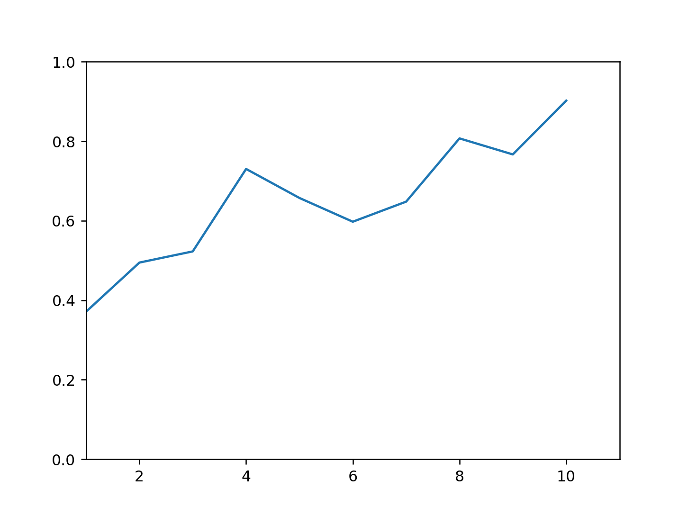
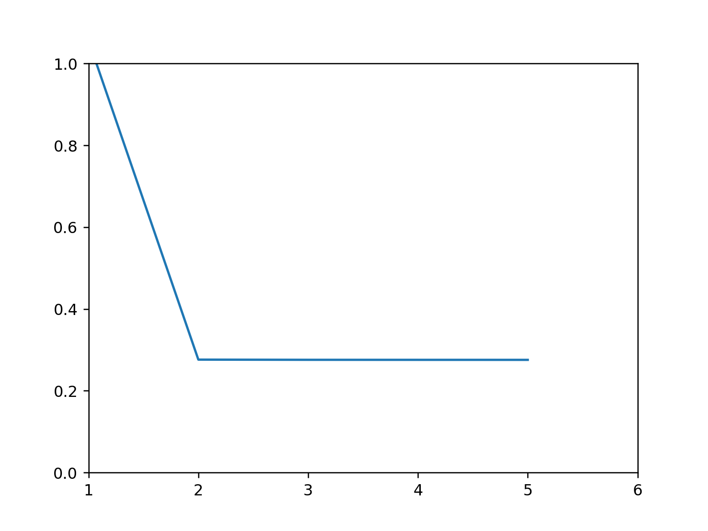

1.首先用标志 `flag.s`运行x86.py。该代码通过一个内存标志“实现”锁。你能理解汇编代码试图做什么吗?

```
❯ cat flag.s
.var flag
.var count

.main
.top

.acquire
mov  flag, %ax      #
test $0, %ax        # 
jne  .acquire       # 如果flag !=0,则跳转到.acquire处,反复检测flag是否为0
mov  $1, flag       # 获取锁(将flag设为1)

# critical section
mov  count, %ax     # 
add  $1, %ax        # 
mov  %ax, count     # count++

# release lock
mov  $0, flag       # 释放锁(flag设为0)

# see if we're still looping
sub  $1, %bx
test $0, %bx
jgt .top        # 如果bx的值大于0则循环(回到.top处执行)

halt
```
<pre>
flag.s 作用见上面的注释,
这个简单的"锁有一个问题",导致它并不能保证互斥,
比如线程0执行 mov  flag, %ax 完后,时钟终端,切到线程1执行,
而线程1在执行 mov  %ax, count 中断,切到线程0,此时线程1是拥有锁的,
线程0继续执行 test $0, %ax ,这时ax的值是0,因为线程有单独的寄存器!!,所以线程1也获得了锁
</pre>    

2.使用默认值运行时, `flag.s`是否按预期工作?它会产生正确的结果吗?使用-M和-R标志跟踪变量和寄存器(并使用-c查看它们的值)。你能预测代码运行时flag最终会变成什么值吗?

运行结果:
```
❯ python2 x86.py -p flag.s -M flag,count -c

 flag count          Thread 0                Thread 1         

    0     0   
    0     0   1000 mov  flag, %ax
    0     0   1001 test $0, %ax
    0     0   1002 jne  .acquire
    1     0   1003 mov  $1, flag
    1     0   1004 mov  count, %ax
    1     0   1005 add  $1, %ax
    1     1   1006 mov  %ax, count
    0     1   1007 mov  $0, flag
    0     1   1008 sub  $1, %bx
    0     1   1009 test $0, %bx
    0     1   1010 jgt .top
    0     1   1011 halt
    0     1   ----- Halt;Switch -----  ----- Halt;Switch -----  
    0     1                            1000 mov  flag, %ax
    0     1                            1001 test $0, %ax
    0     1                            1002 jne  .acquire
    1     1                            1003 mov  $1, flag
    1     1                            1004 mov  count, %ax
    1     1                            1005 add  $1, %ax
    1     2                            1006 mov  %ax, count
    0     2                            1007 mov  $0, flag
    0     2                            1008 sub  $1, %bx
    0     2                            1009 test $0, %bx
    0     2                            1010 jgt .top
    0     2                            1011 halt

```

flag最终为0

3.使用-a标志更改寄存器%bx的值(例如,如果只运行两个线程,就用-a bx=2,bx=2)。代码是做什么的?对这段代码问上面的问题,答案如何?

count 增加4次(每个线程增加2次),flag依然为0,运行结果:

```
❯ python2 x86.py -p flag.s -a bx=2,bx=2 -M flag,count -c

 flag count          Thread 0                Thread 1         

    0     0   
    0     0   1000 mov  flag, %ax
    0     0   1001 test $0, %ax
    0     0   1002 jne  .acquire
    1     0   1003 mov  $1, flag
    1     0   1004 mov  count, %ax
    1     0   1005 add  $1, %ax
    1     1   1006 mov  %ax, count
    0     1   1007 mov  $0, flag
    0     1   1008 sub  $1, %bx
    0     1   1009 test $0, %bx
    0     1   1010 jgt .top
    0     1   1000 mov  flag, %ax
    0     1   1001 test $0, %ax
    0     1   1002 jne  .acquire
    1     1   1003 mov  $1, flag
    1     1   1004 mov  count, %ax
    1     1   1005 add  $1, %ax
    1     2   1006 mov  %ax, count
    0     2   1007 mov  $0, flag
    0     2   1008 sub  $1, %bx
    0     2   1009 test $0, %bx
    0     2   1010 jgt .top
    0     2   1011 halt
    0     2   ----- Halt;Switch -----  ----- Halt;Switch -----  
    0     2                            1000 mov  flag, %ax
    0     2                            1001 test $0, %ax
    0     2                            1002 jne  .acquire
    1     2                            1003 mov  $1, flag
    1     2                            1004 mov  count, %ax
    1     2                            1005 add  $1, %ax
    1     3                            1006 mov  %ax, count
    0     3                            1007 mov  $0, flag
    0     3                            1008 sub  $1, %bx
    0     3                            1009 test $0, %bx
    0     3                            1010 jgt .top
    0     3                            1000 mov  flag, %ax
    0     3                            1001 test $0, %ax
    0     3                            1002 jne  .acquire
    1     3                            1003 mov  $1, flag
    1     3                            1004 mov  count, %ax
    1     3                            1005 add  $1, %ax
    1     4                            1006 mov  %ax, count
    0     4                            1007 mov  $0, flag
    0     4                            1008 sub  $1, %bx
    0     4                            1009 test $0, %bx
    0     4                            1010 jgt .top
    0     4                            1011 halt

```

4.对每个线程将bx设置为高值,然后使用-i 标志生成不同的中断频率。什么值导致产生不好的结果?什么值导致产生良好的结果?

见问题1答案的分析,
坏的情况:
```
❯ python2 x86.py -p flag.s -a bx=2,bx=2 -M flag,count -c -i 1
...
```

5.现在让我们看看程序test-and-set.s。首先尝试理解使用xchg指令构建简单锁原语的代码。获取锁怎么写?释放锁如何写?

```
❯ cat test-and-set.s
.var mutex
.var count

.main
.top    

.acquire
mov  $1, %ax        
xchg %ax, mutex     # 原子操作:交换ax寄存器与内存mutex空间的值(mutex设为1)
test $0, %ax        # 
jne  .acquire       # 如果(%ax)!=0则自旋等待,即原mutex值不为0

# critical section
mov  count, %ax     # 
add  $1, %ax        # 
mov  %ax, count     # count地址的值+1

# release lock
mov  $0, mutex #  mutex设为0(释放锁)

# see if we're still looping
sub  $1, %bx
test $0, %bx  # 多次循环,直到bx值小于等于0
jgt .top        

halt
```

当一个线程获取锁之后mutex变为1,释放锁之后mutex变为0,且操作为原子操作,解决的前面的方案带来的问题

获取锁:
```
mov  $1, %ax        
xchg %ax, mutex
```

释放锁:
```
mov  $0, mutex
```

6.现在运行代码,再次更改中断间隔(-i)的值,并确保循环多次。代码是否总能按预期工作?有时会导致CPU使用率不高吗?如何量化呢?

```
python2 x86.py -p test-and-set.s -a bx=2,bx=2 -M count -c -i 1
python2 x86.py -p test-and-set.s -a bx=2,bx=2 -M count -c -i 2
python2 x86.py -p test-and-set.s -a bx=2,bx=2 -M count -c -i 3
```

<pre>
是, 单核cpu情况下,当一个线程持有锁进入临界区时被抢占,抢占的线程将会自旋一个时间片,导致cpu利用率不高,
量化:计算 当一个线程持有锁进入临界区时被抢占,抢占线程的自旋时间长与总时间长百分比即可
具体实现: `Python3 5.py`, 显示图像,x轴为中断周期,y轴为cpu利用率
</pre>
  
    
    
    
7.使用-P标志生成锁相关代码的特定测试。例如,执行一个测试计划,在第一个线程中获取锁,但随后尝试在第二个线程中获取锁。正确的事情发生了吗?你还应该测试什么?

```
❯ python2 x86.py -p test-and-set.s -M mutex,count -R ax,bx -c -a bx=2,bx=2 -P 0011111

mutex count      ax    bx          Thread 0                Thread 1         

    0     0       0     2   
    0     0       1     2   1000 mov  $1, %ax
    1     0       0     2   1001 xchg %ax, mutex
    1     0       0     2   ------ Interrupt ------  ------ Interrupt ------  
    1     0       1     2                            1000 mov  $1, %ax
    1     0       1     2                            1001 xchg %ax, mutex
    1     0       1     2                            1002 test $0, %ax
    1     0       1     2                            1003 jne  .acquire
    1     0       1     2                            1000 mov  $1, %ax
    1     0       0     2   ------ Interrupt ------  ------ Interrupt ------  
    1     0       0     2   1002 test $0, %ax
    1     0       0     2   1003 jne  .acquire
    1     0       1     2   ------ Interrupt ------  ------ Interrupt ------  
    1     0       1     2                            1001 xchg %ax, mutex
    1     0       1     2                            1002 test $0, %ax
    1     0       1     2                            1003 jne  .acquire
    1     0       1     2                            1000 mov  $1, %ax
    1     0       1     2                            1001 xchg %ax, mutex
    1     0       0     2   ------ Interrupt ------  ------ Interrupt ------  
    1     0       0     2   1004 mov  count, %ax
    1     0       1     2   1005 add  $1, %ax
    1     0       1     2   ------ Interrupt ------  ------ Interrupt ------  
    1     0       1     2                            1002 test $0, %ax
    1     0       1     2                            1003 jne  .acquire
    1     0       1     2                            1000 mov  $1, %ax
    1     0       1     2                            1001 xchg %ax, mutex
    1     0       1     2                            1002 test $0, %ax
    1     0       1     2   ------ Interrupt ------  ------ Interrupt ------  
    1     1       1     2   1006 mov  %ax, count
    0     1       1     2   1007 mov  $0, mutex
    0     1       1     2   ------ Interrupt ------  ------ Interrupt ------  
    0     1       1     2                            1003 jne  .acquire
    0     1       1     2                            1000 mov  $1, %ax
    1     1       0     2                            1001 xchg %ax, mutex
    1     1       0     2                            1002 test $0, %ax
    1     1       0     2                            1003 jne  .acquire
    1     1       1     2   ------ Interrupt ------  ------ Interrupt ------  
    1     1       1     1   1008 sub  $1, %bx
    1     1       1     1   1009 test $0, %bx
    1     1       0     2   ------ Interrupt ------  ------ Interrupt ------  
    1     1       1     2                            1004 mov  count, %ax
    1     1       2     2                            1005 add  $1, %ax
    1     2       2     2                            1006 mov  %ax, count
    0     2       2     2                            1007 mov  $0, mutex
    0     2       2     1                            1008 sub  $1, %bx
    0     2       1     1   ------ Interrupt ------  ------ Interrupt ------  
    0     2       1     1   1010 jgt .top
    0     2       1     1   1000 mov  $1, %ax
    0     2       2     1   ------ Interrupt ------  ------ Interrupt ------  
    0     2       2     1                            1009 test $0, %bx
    0     2       2     1                            1010 jgt .top
    0     2       1     1                            1000 mov  $1, %ax
    1     2       0     1                            1001 xchg %ax, mutex
    1     2       0     1                            1002 test $0, %ax
    1     2       1     1   ------ Interrupt ------  ------ Interrupt ------  
    1     2       1     1   1001 xchg %ax, mutex
    1     2       1     1   1002 test $0, %ax
    1     2       0     1   ------ Interrupt ------  ------ Interrupt ------  
    1     2       0     1                            1003 jne  .acquire
    1     2       2     1                            1004 mov  count, %ax
    1     2       3     1                            1005 add  $1, %ax
    1     3       3     1                            1006 mov  %ax, count
    0     3       3     1                            1007 mov  $0, mutex
    0     3       1     1   ------ Interrupt ------  ------ Interrupt ------  
    0     3       1     1   1003 jne  .acquire
    0     3       1     1   1000 mov  $1, %ax
    0     3       3     1   ------ Interrupt ------  ------ Interrupt ------  
    0     3       3     0                            1008 sub  $1, %bx
    0     3       3     0                            1009 test $0, %bx
    0     3       3     0                            1010 jgt .top
    0     3       3     0                            1011 halt
    0     3       1     1   ----- Halt;Switch -----  ----- Halt;Switch -----  
    1     3       0     1   1001 xchg %ax, mutex
    1     3       0     1   1002 test $0, %ax
    1     3       0     1   1003 jne  .acquire
    1     3       3     1   1004 mov  count, %ax
    1     3       4     1   1005 add  $1, %ax
    1     4       4     1   1006 mov  %ax, count
    0     4       4     1   1007 mov  $0, mutex
    0     4       4     0   1008 sub  $1, %bx
    0     4       4     0   1009 test $0, %bx
    0     4       4     0   1010 jgt .top
    0     4       4     0   1011 halt

```

    结果正确,测试公平性与性能(见书如何评价锁的部分)


8.现在让我们看看 peterson.s 中的代码,它实现了 Peterson算法(在文中的补充栏中提到)研究这些代码,看看你能否理解它。

9.现在用不同的 -i 值运行代码。你看到了什么样的不同行为?

10.你能控制调度(带P标志)来“证明”代码有效吗?你应该展示哪些不同情况?考虑互斥和避免死锁。

11.现在研究 ticket.s 中 ticket锁的代码。它是否与本章中的代码相符?


```
❯ cat ticket.s
.var ticket # ticket = 0
.var turn   # turn = 0
.var count

.main
.top    

.acquire
mov $1, %ax
fetchadd %ax, ticket  # ticket+1 后,旧 ticket 值存入ax
.tryagain
mov turn, %cx         # (%cx) = turn 
test %cx, %ax        
jne .tryagain         # 如果 (%cx) != 旧ticket 值则自旋

# critical section
mov  count, %ax       # get the value at the address
add  $1, %ax          # increment it
mov  %ax, count       # store it back

# release lock
mov $1, %ax           
fetchadd %ax, turn     # turn +1,释放锁

# see if we're still looping
sub  $1, %bx
test $0, %bx
jgt .top        

halt
```

是的,见上面的注释


12.现在运行代码，使用以下标志:-a bx=1000,b=1000（标志设置每个线程循环1000次）。看看随着时间的推移发生了什么，线程是否花了很多时间自旋等待锁？

```
python2 x86.py -p ticket.s -a bx=1000,bx=1000 -c -M count
```

    是,大量时间用于自旋

13.添加更多的线程，代码表现如何？

```
python2 x86.py -p ticket.s -a bx=1000,bx=1000,bx=1000 -c -M count -t 3
```

线程变多,cpu利用率下降

量化实现: 运行`Python3 5.py`, ,x轴为线程数,y轴为cpu利用率



14.现在来看yield.s，其中我们假设yield指令能够使一个线程将CPU的控制权交给另一个线程（实际上，这会是一个OS原语，但为了简化仿真，我们假设有一个指令可以完
成任务）。找到一个场景，其中test-and-set.s浪费周期旋转，但yield.s不会。节省了多少指令？这些节省在什么情况下会出现？

```
❯ cat yield.s
.var mutex
.var count

.main
.top    

.acquire
mov  $1, %ax        
xchg %ax, mutex     # 原子操作:交换ax寄存器与内存mutex空间的值(将mutex设为1)
test $0, %ax       
je .acquire_done    # 如果ax为0则跳转(即 如果原mutex为0)
yield               # 如果ax不为0(即没有获取到锁),yield
j .acquire          # 从yield返回时,跳转到 .acquire 重新执行
.acquire_done

# critical section
mov  count, %ax     
add  $1, %ax        
mov  %ax, count     # count++

# release lock
mov  $0, mutex     # mutex设为0,释放锁

sub  $1, %bx
test $0, %bx       # 循环到bx为0
jgt .top        

halt
```


```
python2 x86.py -p test-and-set.s -a bx=2 -i 13 -t 4 | wc -l
python2 x86.py -p yield.s -a bx=2 -i 13 -t 4 | wc -l
```

15.最后来看 test-and-test-and-set.s。这把锁有什么作用？与test-and-set.s相比，它实现
了什么样的优点？

```
❯ cat test-and-test-and-set.s
.var mutex
.var count

.main
.top    

.acquire
mov  mutex, %ax     
test $0, %ax        
jne .acquire        # 如果 mutex 不是0则跳转(即未获得锁)

mov  $1, %ax        
xchg %ax, mutex     # 原子操作:交换ax寄存器与内存mutex空间的值(将mutex设为1)
test $0, %ax        
jne .acquire        # 如果 mutex 不是0则跳转(即未获得锁)

# critical section
mov  count, %ax     # 
add  $1, %ax        # 
mov  %ax, count     # count++

# release lock
mov  $0, mutex      # mutex 设为1, 释放锁

# see if we're still looping
sub  $1, %bx
test $0, %bx        #
jgt .top        

halt
```
减少了写锁(`xchg`)操作,
Pentium cpu上,
`xchg`需要三个时钟周期,[参考](https://sites.google.com/site/sxm0318001/pentium%E6%8C%87%E4%BB%A4%E5%91%A8%E6%9C%9F%E8%A1%A8)
而`mov`只需要一个时钟周期